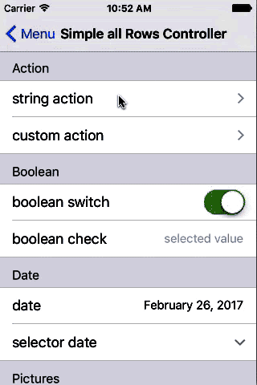
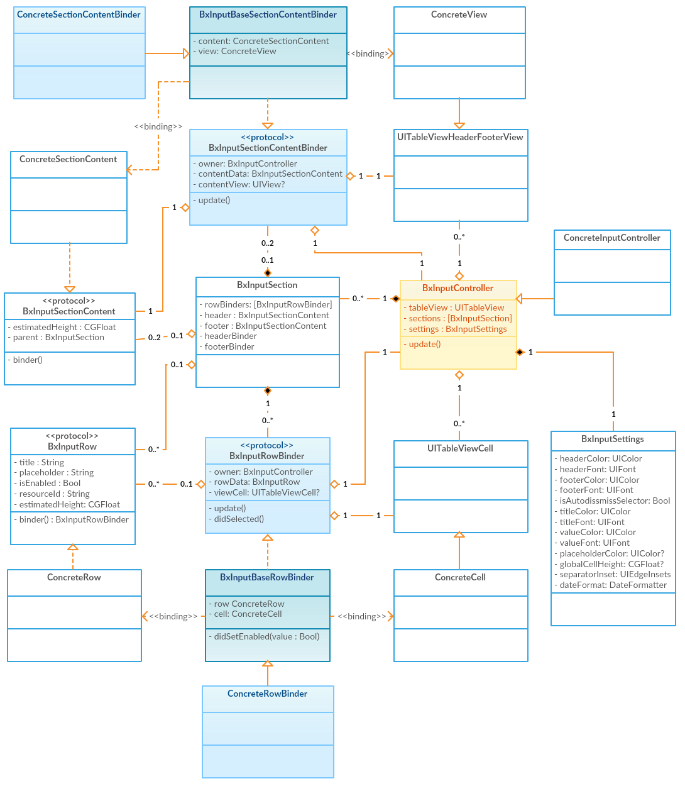
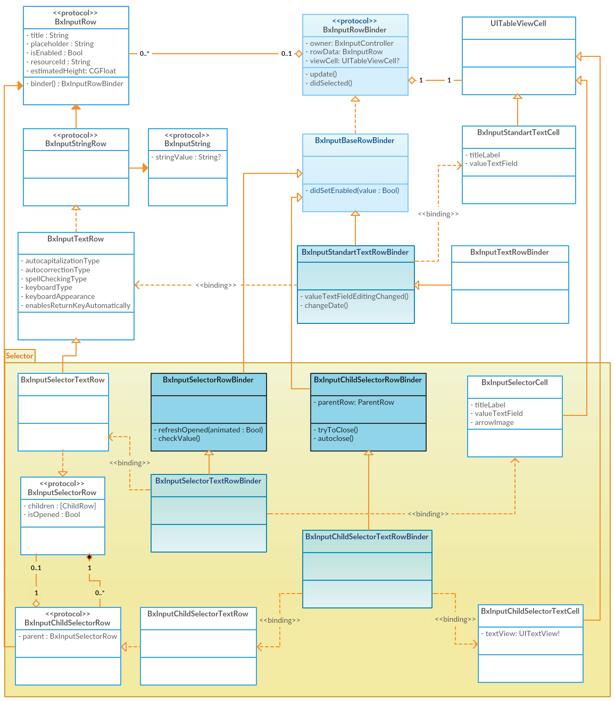

# BxInputController

This framework will help iOS developers for simplify development general inputing controllers. Holds a ready-made solutions, such as standard solutions in Apple applications also have custom design such as a photo library, a choice of variants or suggestion. If you need custom inputting view (for example calendar for date putting) then you may add new rows or edit or inherited current rows. The component is limited only to the implementation of the paradigm, it essentially involves the use of S.O.L.I.D. approach. An important limitation is the compulsory use of Interface Builder to implement UI (xib or storyboard, but not from code).

## Gif demo



## Features

- [x] Encapsulation UITableView DataSource/Delegate/Scrolling and other
- [x] Automatical to register resources (xib, pdf, etc) for cells/headers/footer
- [x] Library general types for inputting: string, date, value objects (variants), pictures, rating, boolean
- [x] Two style inputting: from keyboard or from selector
- [x] Easy to use current solution and make a custom
- [x] S.O.L.I.D. decision: binding View with data models
- [x] UI creating from Interface Builder. Supporting xib and storyboards.
- [x] Has settings for local or global change design and logic.


## Requirements

- iOS 8.0+
- Swift 3.0+


## Installation

### CocoaPods

[CocoaPods](http://cocoapods.org) is a dependency manager for Cocoa projects. You can install it with the following command:

```bash
$ gem install cocoapods
```

To integrate BxInputController into your Xcode project using CocoaPods, specify it in your `Podfile`:

```ruby
source 'https://github.com/CocoaPods/Specs.git'
platform :ios, '8.0'
use_frameworks!

target '<Your Target Name>' do
pod 'BxInputController', '~> 0.9'
end
```

Then, run the following command:

```bash
$ pod install
```


### Swift Package Manager

The [Swift Package Manager](https://swift.org/package-manager/) is a tool for automating the distribution of Swift code and is integrated into the `swift` compiler. It is in early development, but BxInputController does support its use on supported platforms. 

Once you have your Swift package set up, adding BxInputController as a dependency is as easy as adding it to the `dependencies` value of your `Package.swift`.

```swift
dependencies: [
    .Package(url: "https://github.com/ByteriX/BxInputController.git", majorVersion: 1)
]
```

### Manually

If you prefer not to use either of the aforementioned dependency managers, you can integrate `BxInputController` into your project manually.

#### Embedded Framework

- Open up Terminal, `cd` into your top-level project directory, and run the following command "if" your project is not initialized as a git repository:

```bash
$ git init
```

- Add `BxInputController` as a git [submodule](http://git-scm.com/docs/git-submodule) by running the following command:

```bash
$ git submodule add https://github.com/ByteriX/BxInputController.git
```

- Add all sources and resources from local copy of `BxInputController` to the build phase of the project.

- And that's it!


## Usage

### Example for `Gif Demo`

```swift

class SimpleAllRowsController: BxInputController {
    
    // Action
    private let stringActionRow = BxInputActionStringRow(title: "string action")
    private let customActionRow = BxInputActionCustomRow<BxInputActionStringRow>(title: "custom action")
    // Boolean
    private let switchRow = BxInputSwitchRow(title: "boolean switch", value: true)
    private let checkRow = BxInputCheckRow(title: "boolean check", placeholder: "selected value")
    // Date
    private let dateRow = BxInputDateRow(title: "date", value: Date().addingTimeInterval(900000))
    private let selectorDateRow = BxInputSelectorDateRow(title: "selector date")
    // Pictures
    private let selectorPicturesRow = BxInputSelectorPicturesRow(title: "selector pictures")
    // Rate
    private let rateRow = BxInputRateRow(title: "rate", maxValue: 10)
    // Suggestions
    private let selectorSuggestionsRow = BxInputSelectorSuggestionsRow<BxInputSelectorSuggestionsItemRow>(title: "selector suggestions")
    // Text
    private let shortTextRow = BxInputTextRow(title: "text value", placeholder: "short text")
    private let selectorTextRow = BxInputSelectorTextRow(title: "text with selector", placeholder: "longest text")
    // Variants
    private let variantsRow = BxInputVariantsRow<BxInputVariantsItem>(title: "variants")
    private let selectorVariantsRow = BxInputSelectorVariantsRow<BxInputVariantsItem>(title: "selector variants")

    private let variantsItems : [BxInputVariantsItem] = [
        BxInputVariantsItem(id: "1", name: "value1"),
        BxInputVariantsItem(id: "2", name: "value2"),
        BxInputVariantsItem(id: "3", name: "value3"),
        BxInputVariantsItem(id: "4", name: "value4"),
        ]
    private let suggestionItems = [
        BxInputSelectorSuggestionsItemRow(title: "value 1"),
        BxInputSelectorSuggestionsItemRow(title: "value 2"),
        BxInputSelectorSuggestionsItemRow(title: "value 3"),
        BxInputSelectorSuggestionsItemRow(title: "value 4"),
        BxInputSelectorSuggestionsItemRow(title: "value 5")
    ]
    
    override func viewDidLoad() {
        super.viewDidLoad()
        
        isEstimatedContent = false
        stringActionRow.handler = {[weak self] (actionRow) -> Void in
            guard let this = self else {
                return
            }
            this.stringActionRow.value = "changed"
            this.updateRow(this.stringActionRow)
        }
        stringActionRow.isImmediatelyDeselect = true
        customActionRow.handler = {[weak self] (actionRow) -> Void in
            guard let this = self else {
                return
            }
            this.customActionRow.value = this.stringActionRow
            this.updateRow(this.customActionRow)
        }
        customActionRow.isImmediatelyDeselect = true
        selectorSuggestionsRow.children = suggestionItems
        variantsRow.items = variantsItems
        selectorVariantsRow.items = variantsItems

        self.sections = [
            BxInputSection(headerText: "Action", rows: [stringActionRow, customActionRow]),
            BxInputSection(headerText: "Boolean", rows: [switchRow, checkRow]),
            BxInputSection(headerText: "Date", rows: [dateRow, selectorDateRow]),
            BxInputSection(headerText: "Pictures", rows: [selectorPicturesRow]),
            BxInputSection(headerText: "Rate", rows: [rateRow]),
            BxInputSection(headerText: "Suggestions", rows: [selectorSuggestionsRow]),
            BxInputSection(headerText: "Text", rows: [shortTextRow, selectorTextRow]),
            BxInputSection(headerText: "Variants", rows: [variantsRow, selectorVariantsRow])
        ]
    }
    
}

```

### Settings of BxInputController

You can use global settings, rewrited `BxInputSettings.standart` values, also you can make your instanse `BxInputSettings` and assigne its to `BxInputController` instanse by `settings` property.

#### Example for global changing

```swift

class AppDelegate: UIResponder, UIApplicationDelegate {

	var window: UIWindow?

	func application(_ application: UIApplication, didFinishLaunchingWithOptions launchOptions: [UIApplicationLaunchOptionsKey: Any]?) -> Bool
	{
		BxInputSettings.standart.valueFont = UIFont.boldSystemFont(ofSize: 17)
        BxInputSettings.standart.titleFont = UIFont.systemFont(ofSize: 17)
        
        BxInputSettings.standart.titleColor = UIColor.brown
        BxInputSettings.standart.valueColor = UIColor.black
        BxInputSettings.standart.placeholderColor = UIColor.red
        
        BxInputSettings.standart.footerFont = UIFont.boldSystemFont(ofSize: 18)
        BxInputSettings.standart.footerColor = UIColor.gray
        BxInputSettings.standart.headerFont = UIFont.boldSystemFont(ofSize: 18)
        BxInputSettings.standart.headerColor = UIColor.gray
        
        BxInputSettings.standart.separatorInset = UIEdgeInsets(top: 0, left: 0, bottom: 0, right: 0)

		return true
	}


```


### Get values from inputed

All Rows classes (which implement protocol `BxInputRow`)  should encapsulate value for inputting, so it makes easy accessing possible. See for example.

#### Value access example

```swift
class InputController: BxInputController {

    private var email = BxInputTextRow(title: "email value", value: "")
    private var birthdayDate = BxInputDateRow(title: "birthday", placeholder: "YOUR BIRTHDAY")
    private var selectedVariants = BxInputSelectorVariantsRow<BxInputVariantsItem>(title: "selected", 
        placeholder: "SELECT")

    override func viewDidLoad() {
        super.viewDidLoad()

        selectedVariants.items = [
            BxInputVariantsItem(id: "1", name: "value1"),
            BxInputVariantsItem(id: "2", name: "value2"),
            BxInputVariantsItem(id: "3", name: "value3")
        ]

        self.sections = [
            BxInputSection(rows: [email, birthdayDate, selectedVariants])
        ]
    }

    func showInputedValues() {
        print(email.value)
        print(birthdayDate.value)
        print(selectedVariants.selectedVariant.name)
    }
}

```


### Access rows

You can manage access with the help of property `isEnabled` from rows object, but it is not good idea, better use `BxInputController` method `setEnabledRow` for that, because this method encapsulate updating cells of row and its children.

#### Example using setEnabledRow

```swift
class InputController: BxInputController {

	private var emailRow = BxInputTextRow(title: "email value", value: "")

	override func viewDidLoad() {
		super.viewDidLoad()
		self.sections = [
			BxInputSection(rows: [emailRow])
		]
	}

	func changeAccess() {
		setEnabledRow(emailRow, enabled: !emailRow.isEnabled)
	}
}
```

### Change rows and sections

Also you can add, remove, reload or just updating rows or sections. There operation have posibility execution with animation or without that.

#### Example using deleteRow/addRow

```swift
class EnabledAllRowsController: SimpleAllRowsController {
    
    private var choosePhoneRow = BxInputCheckRow(title: "use phone without email")
    private var emailRow = BxInputTextRow(title: "email", value: "")
    private var phoneRow = BxInputTextRow(title: "phone", value: "")
    
    override func viewDidLoad() {
        super.viewDidLoad()
        self.sections = [
            BxInputSection(rows: [choosePhoneRow, emailRow])
        ]
    }
    
    override func didChangedValue(for row: BxInputValueRow)
    {
        if row === choosePhoneRow {
            if choosePhoneRow.value {
                deleteRow(emailRow)
                addRow(phoneRow, after: choosePhoneRow, with: .top)
            } else {
                deleteRow(phoneRow, with: .bottom)
                addRow(emailRow, after: choosePhoneRow)
            }
        }
    }
}
```

### Other table transformation

You can scroll to needed row with method `scrollRow`. 
If you need select (or activate) row, you may call `selectRow`. 
For closing all selectors or/and keyboard you may call `dissmissSelectors`  or `dissmissAllRows`.
table has Event of change value in overrided method `didChangedValue(for row)` in your custom class inherited from `BxInputController` (see last example).

## Paradigm

### Common

Well I have solved create myself solution, abstracting from the conventional concepts, because I have highly specialized task. I think now it is complex solution, please see UML class diagrams below. I used to use classical MVC paradigm in the 1th version. The problem of 1th version: hard linking View with Model, I solved this problem with helping interlayer Binder between View and Model. In the 2th I try to use complex solution basesd from mainstreams for iOS: MVVM, VIPER. The main problem classical paradigm is a hard link controller-View anyway.



### Description with existing paradigmes

`BxInputController` is a UIViewController with the Facade functions, so it may has "presenter" name in VIPER. It manages all ViewModels objects that inherited from `BxInputBaseSectionContentBinder`, `BxInputBaseRowBinder` classes. ViewModels have back-reference with `BxInputController`, because they have the single field of a responsibility drawing UI and may has "interactor" name in VIPER.

Passive Model is objects inherited from `BxInputSection` with `BxInputSectionContent` and `BxInputRow`. It has any information about style of UI and passive data ("Entity" in VIPER). You can use prepared solutions or create yourself implementation, that have to make flexible behavior for this component. `BxInputSection` encapsulated all `BxInputSectionContent` and `BxInputRow` is a source of material for building UI and getting of inputed data. Its are a protocol oriented thin objects.

Relationships `BxInputRow` and `BxInputSectionContent` with UI in a concrete implementation may be shown as Model-ViewModel binding as in MVVM. This function have `BxInputSectionContentBinder` and `BxInputRowBinder` protocols, which implementation should use template classes.

`BxInputSettings` implements appearance pattern. All easy.
So actually it looks like MVVM paradigm, but I like naming this lite-VIPER:


### Simple & Selector

Let's see at different implementations of `BxInputRow`, for represent of simple and selector row types. We will see only text rows for example. In yellow area are shown the selector type classes, the classes as `BxInputTextRow` and `BxInputStandartTextCell` is concrete implementation of simple type of putting text (please see UML class diagrams below). With simple type is all clear, let's see `BxInputSelectorRow` and `BxInputChildSelectorRow`, that is protocols of rows with selector. They have relationship one-to-many. Actually ViewModel for `BxInputSelectorRow` (for this example it is `BxInputSelectorRowBinder`) has responsibility of managing of itself `children` rows. When you select cell for this RowBinder, it should add new row `BxInputChildSelectorTextRow` with help `parent` (this is protocol of `BxInputController`), which presents all cells from rows. If you select again then cell should be closed, and `children` rows should be removed from `BxInputController`. In general `children` is many of objects, but for our example it is single object of the class `BxInputChildSelectorTextRow`. That class does not necessarily have to be public, because it is fully encapsulated in the parent class `BxInputSelectorTextRow`.



## License

BxInputController is released under the MIT license. See LICENSE for details.
